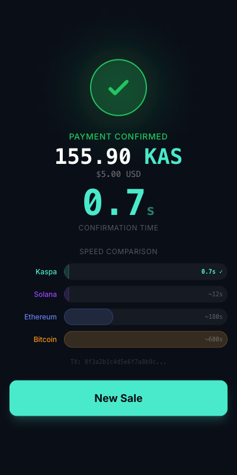

# KaspaPOS

Instant point-of-sale payment terminal for Kaspa. Sub-second PoW confirmations you can see and hear.

**Live Demo:** [https://yonkoo11.github.io/kaspa-pos/](https://yonkoo11.github.io/kaspa-pos/)



## What It Does

KaspaPOS turns Kaspa's sub-second block times into a merchant payment experience:

1. **Enter an amount** using the calculator keypad (USD or KAS)
2. **Show the QR code** to the customer (standard `kaspa:` URI)
3. **Customer scans and pays** from any Kaspa wallet
4. **Payment confirmed in under 1 second** -- with a speed comparison showing Kaspa vs Solana vs Ethereum vs Bitcoin

That's it. The speed is the product.

## Why Kaspa

Every other PoW payment system says "wait 10 minutes for confirmation." Kaspa says "done." This terminal makes that difference impossible to ignore.

The speed comparison bars on the confirmation screen tell the whole story:
- **Kaspa:** 0.8s
- **Solana:** ~12s
- **Ethereum:** ~180s
- **Bitcoin:** ~600s

## Features

- Calculator-style amount entry with USD/KAS toggle
- Live KAS/USD price from CoinGecko
- QR code with standard `kaspa:address?amount=X` URI
- Real-time UTXO polling (300ms intervals) for payment detection
- Animated confirmation with speed comparison bars
- Audio "cha-ching" on payment confirmation
- Transaction history with session totals
- Settings persistence (localStorage)
- Pure client-side -- no backend, no server, no API keys
- Mobile responsive -- works on tablets as a countertop terminal

## Tech Stack

- **Svelte 5** + TypeScript
- **Vite** (build tooling)
- **TailwindCSS 4** (styling)
- **QRCode** library (QR generation)
- **Kaspa REST API** (UTXO detection, price data)
- **CoinGecko API** (KAS/USD exchange rate)

## How It Works

### Payment Detection

When a merchant creates a payment request:

1. App snapshots the current UTXOs on the merchant's address
2. Displays a QR code with the `kaspa:` payment URI
3. Polls `GET /addresses/{address}/utxos` every 300ms
4. When a new UTXO appears that wasn't in the baseline snapshot, payment is confirmed
5. Confirmation time = time from QR display to UTXO detection

No wallet SDK, no transaction signing, no WebSocket -- just HTTP polling against the public Kaspa API. The merchant only receives; they never need to expose a private key.

### Architecture

```
src/
  App.svelte                 # State machine (idle → waiting → confirmed)
  stores/pos.ts              # POS state, payment logic, persistence
  lib/kaspa/payment.ts       # UTXO polling, payment URI builder
  lib/kaspa/price.ts         # KAS/USD price feed (CoinGecko + Kaspa API)
  lib/kaspa/types.ts         # TypeScript types
  components/
    AmountEntry.svelte       # Calculator keypad
    PaymentQR.svelte         # QR code + timer
    Confirmation.svelte      # Success screen + speed comparison
    History.svelte           # Transaction history drawer
```

## Setup

```bash
git clone https://github.com/Yonkoo11/kaspa-pos.git
cd kaspa-pos
npm install
npm run dev
```

Open `http://localhost:5173/kaspa-pos/` and tap the gear icon to set your Kaspa address.

## Deploy

```bash
npm run build
npx gh-pages -d dist
```

## Usage

1. Open the app and tap the gear icon
2. Paste your Kaspa receiving address
3. Enter a payment amount (tap USD/KAS to toggle currency)
4. Tap "Charge" -- QR code appears
5. Customer scans QR with KasWare or any Kaspa wallet
6. Payment confirmed in under 1 second

## Hackathon

Built for [Kaspathon: Build at Internet Speed](https://dorahacks.io/hackathon/kaspathon/detail).

Targeting tracks:
- **Payments & Commerce** -- merchant payment terminal with instant confirmations
- **Main Track** -- real-world application of Kaspa's speed
- **Best UX/UI** -- the entire UX is the speed

## License

MIT
